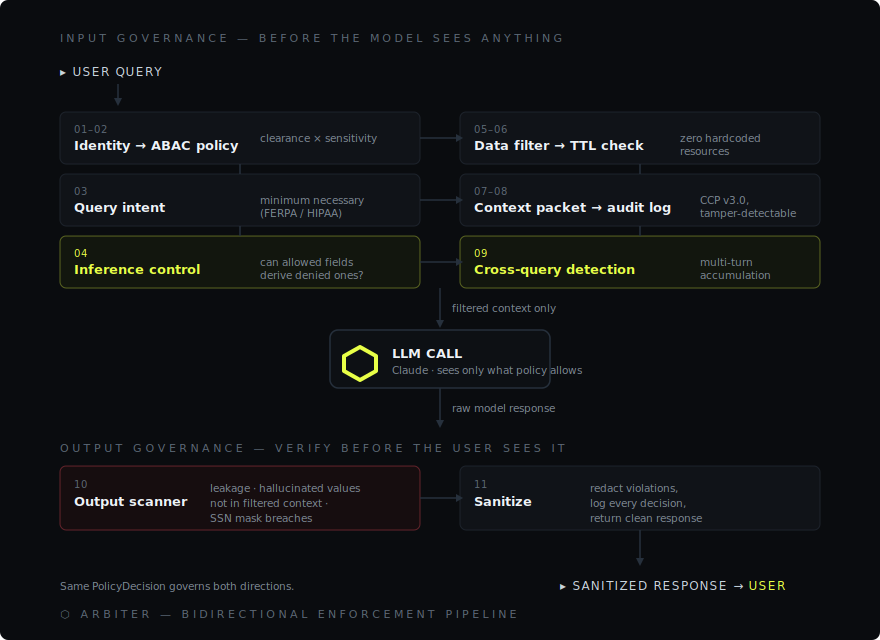

<div align="center">


<br>


</div>

Arbiter is bidirectional AI governance middleware. It enforces access control before the LLM sees data, detects causal inference channels that leak denied information through authorized field combinations, catches multi-turn accumulation attacks across conversation turns, and scans the model's response for hallucinated or leaked restricted data before it reaches the user.

Built for FERPA and HIPAA contexts, where unauthorized AI data access isn't a bug — it's a violation.

## See it run

Same model, same question — *"Show me all financial records"* — asked by a student. The left side has the full database in context. The right side goes through Arbiter.



<!-- Prefer a video player with sound/scrubbing? Record the demo as .mp4,
     open this README in GitHub's web editor, and drag the file right here —
     GitHub hosts it and renders an inline player. GIFs autoplay; mp4s don't. -->

Clone it, run it, and try to leak something yourself — instructions below. No API key needed.

## The problem

**Input governance exists. Output governance doesn't.** You filter what the LLM sees perfectly, and the model still hallucinates a salary from training data. Your filter was flawless. The response leaked anyway.

**Individual access checks pass. Combinations leak.** A teacher can see the department budget ($283,000), the faculty count (2), and her own salary ($95,000). One subtraction later she knows her colleague makes $188,000. Every field was authorized. The combination is a violation.

**Single-query checks pass. Multi-turn attacks succeed.** Research budget in turn 1. TA stipend pool in turn 2. Operating budget in turn 3. Each query is fine on its own — and across three turns the user has reconstructed the total that was withheld.

**Policies don't scale.** Most tools hardcode permissions per role and per resource. Arbiter resolves access at runtime from clearance × sensitivity — adding a resource or a role is a JSON edit, zero code changes.

## How it works



The part that matters: the same `PolicyDecision` that filtered the input scans the output. Input filtering alone is hope. This is verification.

## What existing tools miss

| Existing tools | Arbiter |
|---|---|
| Filter input to the LLM | Filter input **and** scan output |
| Check individual field access | Detect when field *combinations* leak denied data |
| Check single queries | Detect multi-turn accumulation attacks across a conversation |
| Hardcode permissions per role | Resolve access at runtime from clearance × sensitivity (ABAC) |
| Static inference rules | Template-based inference channels that scale to any schema |
| Log what was accessed | Log input governance, inference control, output scanning, and cross-query detection |
| Single-domain | University (FERPA) and hospital (HIPAA) from the same engine |

## Quick start

```bash
git clone https://github.com/SiddhiRohan/arbiter.git
cd arbiter/server
pip install -r requirements.txt
python test_engine.py
python -m uvicorn main:app --reload --port 8000
```

| URL | Page |
|---|---|
| `localhost:8000` | Governed chat (React) |
| `localhost:8000/demo` | Split-screen: ungoverned vs governed |
| `localhost:8000/admin` | Admin dashboard (5 tabs) |
| `localhost:8000/docs` | Interactive API docs |

Optional: create `server/.env` with `ANTHROPIC_API_KEY=your-key` for live AI responses. Without it, the full governance pipeline still runs in demo mode.

<details>
<summary><b>Demo credentials</b> — 7 logins across 5 roles</summary>
<br>

| Username | Role | Person | Clearance |
|---|---|---|---|
| `admin` | Admin | Robert Torres (Dean) | Full-Access |
| `teacher` | Teacher | Sarah Chen (CS) | Department-Scoped |
| `teacher2` | Teacher | James Washington (CS) | Department-Scoped |
| `advisor` | Advisor | Priya Sharma (Math) | Department-Scoped |
| `student` | Student | Alex Rivera (CS) | Self-Scoped |
| `student2` | Student | Carlos Mendez (Math) | Self-Scoped |
| `ta` | TA | Lena Kowalski (CS) | Course-Scoped |

Password = username for all demo accounts.

</details>

## Five things to try

**1. The contrast.** Open `/demo`, select Student, click "All Financials." The left side dumps every salary and SSN. The right side shows only the student's own tuition, SSN masked.

**2. The inference attack.** Select Teacher. Ask "What is the CS department budget?" Arbiter detects that budget + faculty count + own salary = a derivable colleague salary, and withholds the total budget field. The breakdown still comes through — just not enough to do the math.

**3. The multi-turn attack.** As Teacher, ask one at a time: "CS research budget?" then "CS TA stipend pool?" then "CS operating budget?" On query 3, the cross-query accumulator fires — the total was being reconstructed across turns.



*Each query passes on its own. The session accumulator catches the pattern.*

**4. The output catch.** When the LLM reconstructs the withheld $283,000 from component budgets anyway, the output scanner flags a value matching `departments.total_budget` that wasn't in the filtered context. Hallucination violation, logged and redacted.

**5. Domain swap.** Same engine, different data file. University runs FERPA rules, hospital runs HIPAA rules. Zero code changes.

## Inference channels

### Single-query (template-based)

| Template | Detects | Withholds | Roles |
|---|---|---|---|
| T-BUDGET | Budget decomposition → salary derivation | total_budget | Teacher, Advisor |
| T-AVERAGE | Class average + visible grades → hidden grade | class_average | Advisor, TA |
| T-THRESHOLD | GPA below threshold → probation status | gpa | Advisor |
| T-TREND | Declining semester GPAs → at-risk prediction | semester_gpas | Advisor |
| T-AID-TYPE | Employment aid type → TA compensation | scholarship | Admin |
| T-RAISE | Years + raise percent → historical salary | raise_percent | Admin |

### Cross-query (multi-turn)

| Rule | Attack pattern | Fires after |
|---|---|---|
| CQ-001 | Budget components across queries → total budget | 3 queries |
| CQ-002 | Reconstructed budget + salary → others' salary | 4 queries |
| CQ-003 | Multiple semester GPA queries → at-risk prediction | 3 reveals |
| CQ-004 | Individual grades → class average reconstruction | 3 reveals |

Templates match field patterns at runtime against any schema. Add a department and the template fires automatically. Adding a new channel is a JSON edit in `config/inference_graph.json`.

<details>
<summary><b>Architecture</b> — repo layout</summary>

```
arbiter/
├── config/
│   ├── policies.json              # ABAC rules (clearance → sensitivity)
│   ├── roles.json                 # 5 roles with clearance + scope types
│   └── inference_graph.json       # Template-based causal inference channels
├── data/
│   ├── demo_university.json       # 15 people, 8 resources, FERPA
│   ├── demo_hospital.json         # 12 people, 7 resources, HIPAA
│   └── generate_data.py           # Data generator
├── server/
│   ├── arbiter_engine.py          # Bidirectional enforcement pipeline
│   ├── policy_engine.py           # ABAC evaluation engine
│   ├── data_filter.py             # Generic scalable filter + scope resolvers
│   ├── query_intent.py            # Minimum necessary access classifier
│   ├── output_scanner.py          # Leakage, hallucination, mask breach
│   ├── session_accumulator.py     # Cross-query multi-turn detection
│   ├── context_packet.py          # CCP v3.0 tamper-detectable records
│   ├── audit_logger.py            # Non-blocking (QueueHandler) pipeline
│   ├── auth.py                    # Session management, 7 demo logins
│   ├── admin_routes.py            # Admin CRUD API
│   ├── main.py                    # FastAPI + bidirectional chat endpoint
│   ├── test_engine.py             # 8 integration tests
│   └── test_api.py                # 14 API tests
├── frontend/
│   ├── chat.html                  # React — governed chat + pipeline viz
│   ├── demo.html                  # React — split-screen with auto-run
│   └── admin.html                 # Admin dashboard (5 tabs)
├── assets/                        # Brand assets, README graphics
└── README.md
```

</details>

<details>
<summary><b>API endpoints</b></summary>
<br>

| Endpoint | Method | Description |
|---|---|---|
| `/login` | POST | Authenticate and create session |
| `/logout` | POST | Destroy session |
| `/chat` | POST | Bidirectional governed chat |
| `/chat/ungoverned` | POST | Raw unfiltered chat (demo) |
| `/health` | GET | Server status |
| `/audit-log` | GET | Audit entries |
| `/context-packet/{id}` | GET | CCP v3.0 packet |
| `/admin/roles` | GET/POST | Role management |
| `/admin/policies` | GET/PUT | Policy management |
| `/admin/resources` | GET | Resource descriptors |
| `/demo/roles` | GET | Demo credentials |

</details>

<details>
<summary><b>Data edge cases</b> — the demo data is deliberately messy</summary>
<br>

| Person | Edge case |
|---|---|
| P003 Lena | TA for two classes (CS101 + DS200) |
| P004 Carlos | Academic probation AND delinquent tuition |
| P005 David | CS student advised by a Math professor |
| P007 Emily | CS major enrolled in a Business class |

</details>

## Tech stack

Python + FastAPI + Uvicorn on the backend, Claude via the Anthropic API, JSON-driven ABAC policy engine, template-based causal inference graph, session accumulator for cross-query detection, pattern-matching output scanner with hallucination detection, non-blocking audit pipeline (QueueHandler), React (CDN) frontends, session auth with TTL.

## Roadmap

- [ ] Multi-tenant UI switcher (hospital + university dropdown)
- [ ] Auto-detection of inference channels from data schema
- [ ] Policy simulation endpoint
- [ ] Prompt injection detection
- [ ] Database-backed policy storage
- [ ] FHIR/SIS data source connectors

---

<div align="center">

**⬡ Control what AI sees. Verify what AI says.**

MIT License · Built at HackPSU Spring 2026

</div>
